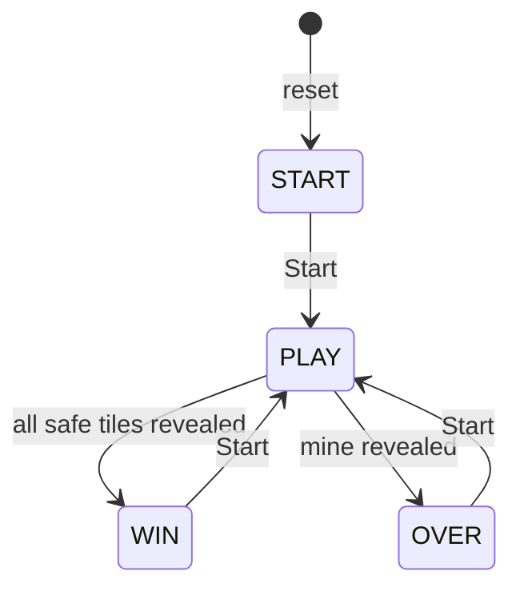

# FPGA Minesweeper for Basys3

A first-generation, hardware-based Minesweeper game written in Verilog and
SystemVerilog. The design runs on a Digilent Basys3 FPGA, draws the game on a
640×480 VGA display, and accepts input from a SNES-style controller through a
Gamepad Pmod.

The game uses a finite-state machine (FSM) for the title screen, active game,
win screen, and game-over screen. All game logic, input handling, timing, and
graphics are implemented in RTL; no processor or software runtime is required.

## Features

- 5×5 Minesweeper board with a fixed layout of 3 mines
- Four-state game FSM: `START`, `PLAY`, `WIN`, and `OVER`
- Direction-pad cursor movement in all four directions
- A button to reveal the selected tile
- Start button to begin a game or play again after winning or losing
- Three-digit game timer that counts from `000` to `999` seconds
- 640×480 VGA output with 2-bit internal RGB color channels
- Synthesizable Verilog/SystemVerilog implementation for the Basys3
- Tiny Tapeout-compatible core module and a separate Basys3 wrapper

## Controls

| Controller input | Action |
| --- | --- |
| D-pad Up | Move the cursor up one tile |
| D-pad Down | Move the cursor down one tile |
| D-pad Left | Move the cursor left one tile |
| D-pad Right | Move the cursor right one tile |
| A | Reveal the selected tile |
| Start | Start the game; start a new game after a win or game over |

Movement stops at the edge of the board. Revealing a mine ends the game and
shows the complete board. Revealing all 22 safe tiles wins the game.

## Game state machine

The active-low reset returns the design to `START`. Pressing Start from the win
or game-over screen clears the visible board, resets the timer and cursor, and
begins a new game. The current RTL does not implement pause/resume while in the
`PLAY` state.

## Hardware

- Digilent Basys3 FPGA board
- VGA monitor and VGA cable
- Gamepad Pmod connected to header JC
- Compatible SNES-style controller

The Gamepad Pmod signals used by the core are:

| Signal | Core port | Basys3 connection |
| --- | --- | --- |
| Latch | `ui_in[4]` | JC7 |
| Clock | `ui_in[5]` | JC8 |
| Data | `ui_in[6]` | JC9 |

VGA RGB, horizontal sync, and vertical sync signals use the Basys3 onboard VGA
connector through the supplied constraints file.

## RTL organization

| File | Purpose |
| --- | --- |
| `src/project.sv` | Minesweeper FSM, board data, timer, input handling, and VGA renderer |
| `src/gamepad_pmod.v` | Serial Gamepad Pmod receiver and button decoder |
| `src/hvsync_generator.v` | 640×480 VGA timing generator |
| `src/topFPGA_vgaPlayground.v` | Basys3 top-level wrapper and RGB expansion |
| `src/Basys3_vgaPlayground.xdc` | Basys3 clock, Pmod, reset, and VGA pin constraints |
| `info.yaml` | Tiny Tapeout project metadata and source list |
| `test/test.py` | Cocotb VGA timing and frame-capture test |

The main game core is `tt_um_vga_example`. For a Basys3 build, use `top_FPGA`
as the synthesis top module.

## Build with Vivado

1. Create a new RTL project for the Digilent Basys3 board or its Artix-7 part.
2. Add these design sources:
   - `src/project.sv`
   - `src/gamepad_pmod.v`
   - `src/hvsync_generator.v`
   - `src/topFPGA_vgaPlayground.v`
3. Add `src/Basys3_vgaPlayground.xdc` as a constraints file.
4. Create a Clocking Wizard IP named `clk_wiz_0` with:
   - input port `clk_100` at 100 MHz
   - output port `clk_25` at 25 MHz
5. Set `top_FPGA` as the top module.
6. Run synthesis, implementation, and bitstream generation.
7. Program the Basys3, connect the VGA display and controller, release reset,
   and press Start.

> **Reset constraint:** the supplied XDC currently contains mappings for both
> Basys3 switch SW0 (`V17`) and button BTNR (`T17`) using the same `rst_n` port.
> Keep only the mapping you want before implementation. Because reset is
> active-low, a switch is generally easier to use: `0` resets the game and `1`
> runs it.

## VGA interface

The renderer generates 640×480 timing from a 25 MHz pixel clock. The core packs
the VGA signals into `uo_out` for Tiny Tapeout compatibility:

| Output | Function |
| --- | --- |
| `uo_out[7]` | HSync |
| `uo_out[6]`, `uo_out[2]` | Blue bits |
| `uo_out[5]`, `uo_out[1]` | Green bits |
| `uo_out[4]`, `uo_out[0]` | Red bits |
| `uo_out[3]` | VSync |

The Basys3 wrapper expands each 2-bit color channel to the board's 4-bit VGA
channel.

## How the game works

The hidden board is stored in `MAP`, while `STATE` stores what the player can
currently see. Each cell is encoded as covered, empty, mine, one, two, or three.
The current board is fixed in RTL rather than generated randomly. The selected
tile is highlighted in green, while the board and timer use bitmap glyphs drawn
directly by the VGA renderer.

Directional inputs and Start are edge-detected, so holding a direction does not
repeatedly move the cursor. The A input reveals a covered tile. The timer runs
only during `PLAY` and saturates at 999 seconds.

## Demo

[Watch the gameplay video on Google Drive](https://drive.google.com/file/d/1L6-S8w9kwQh01fShiNzQ4B8pVKpkwlmq/view?usp=sharing),
or download [the video included in this repository](testing_video.mp4).

## Current limitations

- The mine layout is fixed; there is no random board generator.
- Flagging tiles is not implemented.
- Empty regions do not automatically expand.
- Start does not pause or resume an active game.
- The board uses only number glyphs 1 through 3 because the fixed map has no
  larger adjacent-mine counts.
